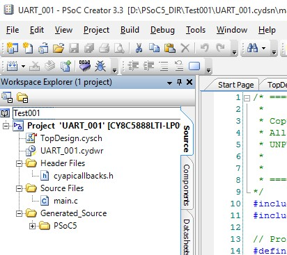

# Project template for PSoC 5 LP CY8CKIT-059 10 dollars kit board
---
## Description

In this article I will give a start template project so you can begin using the PSoC 5 LP kit in your project, in an easy way.
[The kit site page](http://www.cypress.com/documentation/development-kitsboards/cy8ckit-059-psoc-5lp-prototyping-kit-onboard-programmer-and)

The kit comes with 3 examples:
- A button and led example.
- A ADC and UART example.
- A USB HID example.

And there is more example code for the PSoC 5 in the PSoC Creator **Menu->File->Code Example…** **filter** by Device family: **PSoC 5 LP**. 
But I made this start template project because it seemed more useful to me, and I share here with you.

[Start template GitHub page](https://github.com/joaocarvalhoopen/Project_template_for_PSoC_5_LP_CY8CKIT-059_kit)

The **characteristics** of this start template are:
- The UART is configured, and the project has code to send and receive data from the PC, with the pins configured P12[6] and P12[7]. Although this kit has a programmer with debugger this really useful in the development process. The wires between the programmer board part of the board and the PSoC 5 LP board came already connected so you don’t have to connect any wire.
- Has the switch of the kit already mapped to an input pin in resistive pullup mode, with code that send the status of the pin to the PC by UART.
- Has the blue LED mapped to an output pin in strong mode, showing it the state on the PC and permitting to change the state from the PC.
- Has a chip internal clock configured to 3MHz (maximum precision of +-1%) but the PLL configured to 70MHz for internal chip clock.
- Has a schematic sheet in a big A3 format. You can add more sheets.

---
## How to connect from the PC

Connect the Kit to your PC using USB. 
Copy the project to a directory on you PC and open it with PSoC Creator 3.3 or greater. 
Build the project and program the kit board. 
To connect by UART to the kit, download the free serial terminal program PuTTY in [PuTTY site](http://www.chiark.greenend.org.uk/~sgtatham/putty/download.html)
this program is similar to the Arduino terminal monitor.

To find what is the virtual COM port that is attributed in you windows PC  **Start -> Control Panel -> Device Manager**. 
Configure the PuTTY terminal session with the following UART configuration:
- baud rate: 115200bps
- data bits: 8
- parity: None
- stop bits: 1
- flow control: None

And press ‘M’ and a menu appears with the following commands.

The are 3 counters, 8 bits a 16 bits and a 32 bits.

---
## How use this template project to create you projects

To use this project has a template for new project named Test001, you simply have to make a copy of the workspace directory (the directory where the project is in), and rename it to the name of your workspace in file explorer.
Open the project and in the menu Build->Clean UART_001, to remove the build files.

Then open the workspace in the PSoC Creator 3.3 or greater and with the right mouse button click over the workspace name in the left tree and rename to the workspace name, right click on the project to rename the project to the new project name.

Rename workspace:

Rename project:

Save all files.

Build the project in menu **Build->Clean and Build Test001…**. 
And now go to the directory of your workspace/project and **delete the following old files**:
- Test001\UART_001.cywrk.joao.nuno.carvalho
- Test001\Test001.cydsn\UART_001.cycdx
- Test001\Test001.cydsn\UART_001.cyfit
- Test001\Test001.cydsn\UART_001.cyprj.joao.nuno.carvalho
- Test001\Test001.cydsn\UART_001.rpt
- Test001\Test001.cydsn\UART_001.svd
- Test001\Test001.cydsn\UART_001_timing.html

**And you are all set to go!**
---
